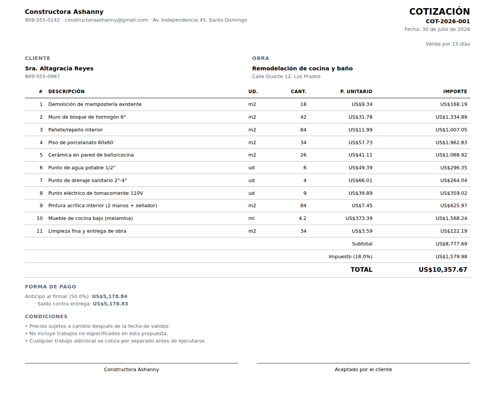

# Cotizador de Obra

Cotizador de construcción para contratistas pequeños. Un archivo HTML, sin
servidor, sin cuentas, sin internet.

**[Ver la página](index.html) · [Abrir la app](app/) · [Descargar el archivo único](dist/cotizador.html)**



---

## Qué problema resuelve

Un contratista pequeño pierde dinero en dos lugares, y ninguno es la obra:

1. **Cotizar tarde.** La cotización se hace de noche, cansado, en una hoja de
   Excel que se rompió hace dos versiones. El cliente ya llamó a otro.
2. **Cotizar mal.** Se confunde markup con margen, se olvida el desperdicio,
   no se cargan los gastos generales. La obra "salió bien" y al final no quedó
   nada.

Esta herramienta ataca las dos: arma la cotización en minutos con un catálogo
de 48 partidas, y calcula el precio con margen real sobre la venta.

## El detalle que más dinero mueve

| Cómo lo calculas | Cobras | Ganas | Margen real |
|---|---:|---:|---:|
| Costo × 1.25 | $12,500.00 | $2,500.00 | **20.0%** |
| Costo ÷ 0.75 | $13,333.33 | $3,333.33 | **25.0%** |

Sobre un costo de $10,000, querer ganar 25% y multiplicar por 1.25 deja 20%.
Son **$833 por cotización**. La app usa margen real por defecto, y si eliges
markup te muestra en pantalla la diferencia exacta en pesos.

## Cómo empezar

1. Abre `dist/cotizador.html` (doble clic; también funciona en el celular).
2. Llena **Datos de mi empresa** — es lo que encabeza la cotización impresa.
3. Busca partidas, ajusta cantidades, imprime.

> **Antes de cotizarle a un cliente real:** los precios del catálogo son una
> plantilla de arranque, no una lista de precios. Siéntate media hora con tres
> facturas recientes de tu ferretería y corrige las partidas que más usas. A
> partir de ahí la herramienta cotiza con *tus* números.

Los datos se guardan en tu navegador. Usa **Respaldo** cada tanto y guarda el
archivo en tu correo: si borras los datos del navegador, se van.

## Estructura

```
index.html              Página de presentación
app/index.html          App en modo desarrollo (módulos sueltos)
dist/cotizador.html     Archivo único autocontenido  ← lo que se reparte
src/
  calc.js               Motor de cálculo (puro, sin DOM)
  catalog.js            48 partidas de obra + búsqueda
  storage.js            Persistencia en localStorage, respaldos
  ui.js                 Interfaz e impresión
  styles.css            Estilos, incluida la hoja de impresión
tests/
  calc.test.js          Matemática del dinero
  datos.test.js         Catálogo, búsqueda, respaldos, correlativos
  navegador.test.js     End-to-end sobre el bundle real, en Chromium
build.js                Empaqueta todo en dist/cotizador.html
muestra.mjs             Genera las capturas y el PDF de ejemplo
```

## Desarrollo

```bash
npm test        # 42 pruebas: unitarias + end-to-end en navegador
npm run build   # regenera dist/cotizador.html
```

Cero dependencias en tiempo de ejecución. `playwright` es opcional y solo para
las pruebas de navegador: si no está instalado, esa prueba se salta sola.

### Decisiones de diseño que no son obvias

- **El desperdicio se aplica solo al material.** Al ayudante se le paga por
  pegar el bloque, no por el bloque roto.
- **Los totales de línea se redondean antes de sumar.** Un cliente que suma la
  columna con la calculadora del teléfono tiene que llegar exactamente al
  subtotal impreso.
- **El margen se reparte proporcionalmente entre las partidas** para el
  documento del cliente, y el céntimo de descuadre se absorbe en la partida
  mayor, donde no se nota. El cliente nunca ve costos ni utilidad.
- **Sin backend, a propósito.** Lo que le pagas al bloquero es tu ventaja
  competitiva; no tiene por qué estar en el servidor de nadie.

## Licencia

MIT. Úsalo, cámbialo, véndelo.
